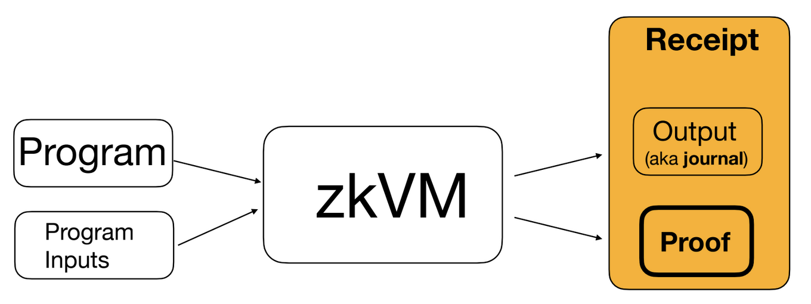
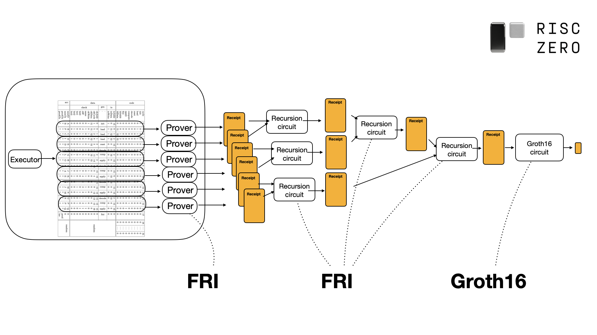

# Proof System Overview

When the RISC Zero [zkVM] executes, it produces a [Receipt] that serves as a
proof of validity of a given [Session].

To confirm that a [Receipt] was honestly generated, use [Receipt::verify()].

The [Receipt] includes a [journal], which contains the public outputs of the
[Session]. The contents of the [journal] are specified by calling
[env::commit()] and [env::commit_slice()] in the [guest] code.

In addition to the journal, a receipt makes a number of claims about the program
execution. These claims are summarized in the [ReceiptClaim].

### Types of Receipts

A [Receipt] can take four main forms.

1. A **[composite receipt]** is a vector of [ZK-STARK]s, one for each [segment].
   Segments & segment proofs are constructed using the [RISC-V Circuit].
2. A **[succinct receipt]** is a single [ZK-STARK] proving an entire [Session].
   A succinct receipt is formed by aggregating the proofs from a composite
   receipt. This is accomplished using the [Recursion Circuit]. Users can also
   aggregate multiple succinct receipts into a single succinct receipt using
   [proof composition].
3. A **[Groth16 receipt]** is a single [Groth16] proof for an entire [Session].
   A Groth16Receipt is formed by verifying a succinct receipt using RISC Zero's
   [Groth16 circuit].
4. A **[fake receipt]** doesn't contain any proof at all. This feature is
   offered to enable rapid prototyping. See [dev-mode] for more information.

The diagram above shows RISC Zero's full proving stack, including the [RISC-V
Circuit], the [Recursion Circuit], and the [Groth16 Circuit]. In this diagram,
the [composite receipt] is the collection of 6 stacked receipts, the [succinct
receipt] is the single receipt after the last use of FRI, and the [Groth16
Receipt] is the tiny receipt that comes from the Groth16 Circuit. For a video
explanation of this architecture and the associated terminology, check out our
[talk from zkSummit 10][zksummit-10].

The details of the RISC Zero ZK-STARK protocol are described in our [ZKP
Whitepaper] and in this [Sequence Diagram]. Documentation for our Groth16
circuit is available in the [zkVM] docs.

### Open-Source Proving

All three of these circuits are open-source and permissionless; anyone may
generate proofs on their own hardware using the implementations available at our
[GitHub]. Users may also choose to delegate the work of proof generation to
[Bonsai].

Read more about our philosophy on open-source software [here][open-source].

## Learn More

In addition to the links in the sidebar, we recommend the following resources:

- [About the zkVM][about-zkvm]
- [RISC Zero News][news]
- [Start Building][quickstart]
- [Study Club]

[about-zkvm]: /api/zkvm
[Bonsai]: https://bonsai.xyz
[composite receipt]: https://docs.rs/risc0-zkvm/*/risc0_zkvm/struct.CompositeReceipt.html
[dev-mode]: /api/generating-proofs/dev-mode
[env::commit()]: https://docs.rs/risc0-zkvm/*/risc0_zkvm/guest/env/fn.commit.html
[env::commit_slice()]: https://docs.rs/risc0-zkvm/*/risc0_zkvm/guest/env/fn.commit_slice.html
[fake receipt]: https://docs.rs/risc0-zkvm/*/risc0_zkvm/enum.InnerReceipt.html#variant.Fake
[GitHub]: https://github.com/risc0/risc0
[Groth16]: ../terminology#groth16
[Groth16 receipt]: ../terminology#groth16-receipt
[Groth16 Circuit]: ../terminology#groth16-circuit
[guest]: https://docs.rs/risc0-zkvm/*/risc0_zkvm/guest
[ImageID]: https://docs.rs/risc0-zkvm/*/risc0_zkvm/struct.SystemState.html
[journal]: https://docs.rs/risc0-zkvm/*/risc0_zkvm/struct.Receipt.html#structfield.journal
[news]: https://www.risczero.com/news
[open-source]: https://www.risczero.com/news/open-source
[proof composition]: ../terminology#composition
[quickstart]: /api/zkvm/quickstart
[Receipt]: https://docs.rs/risc0-zkvm/*/risc0_zkvm/struct.Receipt.html
[ReceiptClaim]: https://docs.rs/risc0-zkvm/*/risc0_zkvm/struct.ReceiptClaim.html
[Receipt::verify()]: https://docs.rs/risc0-zkvm/*/risc0_zkvm/struct.Receipt.html#method.verify
[Recursion Circuit]: ../terminology#recursion-circuit
[RISC-V Circuit]: ../terminology#risc-v-circuit
[segment]: ../terminology#segment
[SegmentReceipts]: https://docs.rs/risc0-zkvm/*/risc0_zkvm/struct.SegmentReceipts.html
[SegmentReceipt]: https://docs.rs/risc0-zkvm/*/risc0_zkvm/struct.SegmentReceipt.html
[Sequence Diagram]: ./proof-system-sequence-diagram.md
[session]: ../terminology#session
[Study Club]: ../studyclub.md
[succinct receipt]: https://docs.rs/risc0-zkvm/*/risc0_zkvm/struct.SuccinctReceipt.html
[ZKP Whitepaper]: https://www.risczero.com/proof-system-in-detail.pdf
[zksummit-10]: https://www.youtube.com/watch?v=wkIBN2CGJdc
[zkVM]: https://docs.rs/risc0-zkvm
[ZK-STARK]: ../reference-docs/about-starks.md
